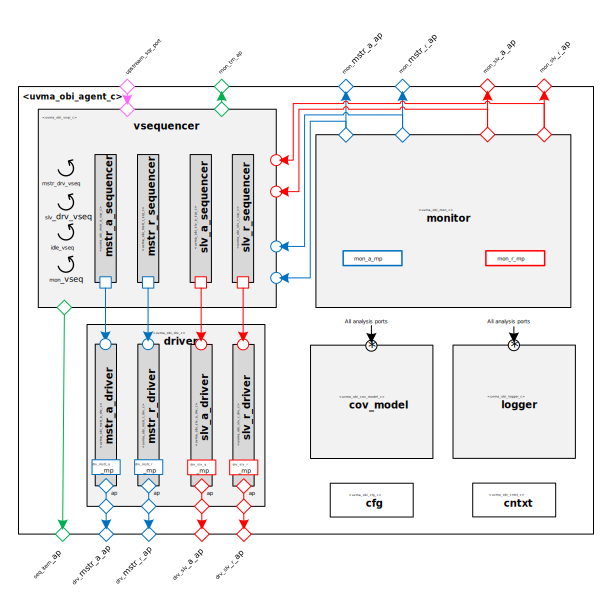

# Home Page

## [Get Latest Release](https://mooreio.com/packages/uvma_obi.tgz)
### [View Documentation online](https://mooreio.com/packages/uvma_obi/dox_out/)

----------------

## About
The [Moore.io](https://www.mooreio.com) UVM [Open Bus Interface (OBI)](https://github.com/openhwgroup/core-v-docs/tree/master/cores/obi) Agent is a pure-UVM, [sequence-based implementation](https://www.linkedin.com/pulse/advanced-uvm-brian-hunter/) of the open standard that can act as either an active `mstr`/`slv` or as a purely passive Monitor. 

This project consists of the agent (`uvma_obi_pkg`), the UVM Memory Model (`uvml_mem`), the self-testing UVM environment (`uvme_obi_st_pkg`) and the test bench (`uvmt_obi_st_pkg`) to verify the agent against itself.

[About the IP](about.md)

## Management

| **[Issues](https://github.com/Datum-Technology-Corporation/uvma_obi/issues)** | **[Discussions](https://github.com/Datum-Technology-Corporation/uvma_obi/discussions)** |
| **[Sub-Projects](https://github.com/Datum-Technology-Corporation/uvma_obi/projects)** | **[Wiki](https://github.com/Datum-Technology-Corporation/uvma_obi/wiki)** |

## Downloads

| Latest Release (v1.0 Beta 0) | Stable (Nightly) | Stable (Weekly) |
| --------------------- | ---------------- | --------------- |
| [Source Code](https://mooreio.com/packages/uvma_obi.tgz) | Source Code (Coming Soon) | Source Code (Coming Soon) |
| [Documentation](https://mooreio.com/packages/uvma_obi/dox_out/) | Documentation (Coming Soon) | Documentation (Coming Soon) |

> **View All Releases(releases.md)**

## Metrics

| Latest Release (v1.0 Beta 0) | Stable (Nightly) | Stable (Weekly) |
| --------------------- | ---------------- | --------------- |
| Functional Coverage Report (Coming Soon) | Functional Coverage Report (Coming Soon) | Functional Coverage Report (Coming Soon) |
| [Release Regression Test Report](https://mooreio.com/packages/uvma_obi/sim/results.html) | Regression Test Report (Coming Soon) | Regression Test Report (Coming Soon) |

----------------

## News
### 2021/10/22 - Hello, World!
The Moore.io Core Libraries are being brought online for the very first time. Watch this space in the near future!
